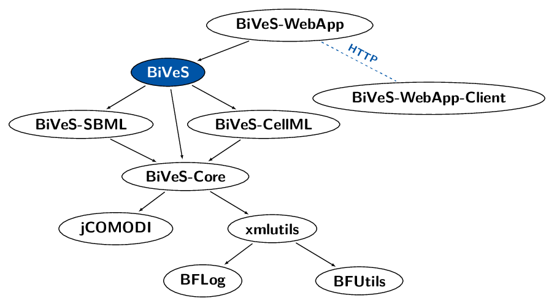

# BiVeS Framework

 BiVeS is a library based on the XyDiff algorithm. It is able to detect differences between two versions of a computational model and to communicate these changes.

The Algorithm implemented in BiVeS was published as
> Martin Scharm, Olaf Wolkenhauer, Dagmar Waltemath:
> [An algorithm to detect and communicate the differences in computational models describing biological systems.](https://doi.org/10.1093/bioinformatics/btv484)
> *Bioinformatics* 32 (4): 563-570;

**More documentation on the BiVeS framework** can be found and the [GitHub pages of the SEMS project](https://semsproject.github.io/BiVeS/).

## BiVeS consists of several modules

BiVeS itself consists of a number of modules:

* [xmlutils](https://github.com/binfalse/xmlutils) is a library for advanced XML handling
* [jCOMODI](https://github.com/binfalse/jCOMODI/) provides programmatic access to the [COMODI ontology](http://purl.uni-rostock.de/comodi/)
* [BiVeS-Core](https://github.com/binfalse/BiVeS-Core) is the core library for comparison of computational models
* [BiVeS-SBML](https://github.com/binfalse/BiVeS-SBML/) is a module providing special strategies for models encoded in SBML
* [BiVeS-CellML](https://github.com/binfalse/BiVeS-CellML) is a module providing special strategies for models encoded in CellML
* [BiVeS](https://github.com/binfalse/BiVeS) ties all modules together and provides command line access
* [BiVeS-WebApp](https://github.com/binfalse/BiVeS-WebApp) is a web interface to access BiVeS through the network
* [BiVeS-WebApp-Client](https://github.com/binfalse/BiVeS-WebApp-Client) provides a Java library for comparing models using the BiVeS-WebApp

 This work is licensed under a <a rel="license" href="http://creativecommons.org/licenses/by-sa/4.0/">Creative Commons Attribution-ShareAlike 4.0 International License</a>.

## Usage of BiVeS

BiVeS currently supports different flavours of XML documents.
It supports special comparison strategies for computational models encoded in SBML (though [BiVeS-SBML](https://github.com/binfalse/BiVeS-SBML)) or CellML (through [BiVeS-CellML](https://github.com/binfalse/BiVeS-CellML)).

To just compare two documents `A.xml` and `B.xml` just call it as:

    java -jar BiVeS.jar A.xml B.xml

The output will be an XML patch listing all operations necessary to convert `A.xml` into `B.xml`.
An XSD schema for the XML can be found in [res/bives-diff-schema.xsd](res/bives-diff-schema.xsd).

BiVeS supports other output formats and flags to activate special merge strategies, just call it with `--help` to get a full list of available options.

There is also a Web Application that happily accepts thrown models and returns comparison results.
Just have a look at [BiVeS-WebApp](https://github.com/binfalse/BiVeS-WebApp) and its demo instance at [bives.bio.informatik.uni-rostock.de](https://bives.bio.informatik.uni-rostock.de/).

## LICENSE

Artwork and text etc is licensed under a [Creative Commons Attribution-ShareAlike 4.0 International License](http://creativecommons.org/licenses/by-sa/4.0/) .

The code is licensed under an Apache 2.0 license:

    Copyright martin scharm <https://binfalse.de/contact/>

    Licensed under the Apache License, Version 2.0 (the "License");
    you may not use this file except in compliance with the License.
    You may obtain a copy of the License at

       http://www.apache.org/licenses/LICENSE-2.0

    Unless required by applicable law or agreed to in writing, software
    distributed under the License is distributed on an "AS IS" BASIS,
    WITHOUT WARRANTIES OR CONDITIONS OF ANY KIND, either express or implied.
    See the License for the specific language governing permissions and
    limitations under the License.

